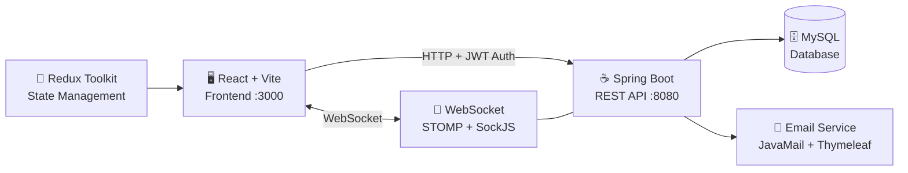
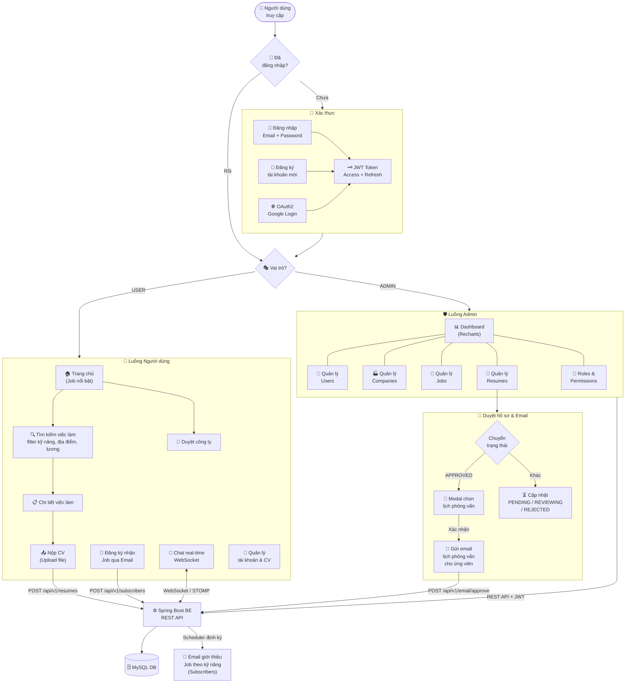

# 🎯 JobHunter — Frontend

<p align="center">
  Nền tảng tìm kiếm việc làm hiện đại được xây dựng với <strong>React 18 + Vite + TypeScript</strong>
</p>

<p align="center">
  
  
  
  
  
  
</p>

<p align="center">
  <a href="#-giới-thiệu">➡ Giới thiệu</a> •
  <a href="#️-luồng-hoạt-động">➡ Luồng hoạt động</a> •
  <a href="#-tính-năng">➡ Tính năng</a> •
  <a href="#️-công-nghệ-sử-dụng">➡ Công nghệ</a> •
  <a href="#-cấu-trúc-dự-án">➡ Cấu trúc</a> •
  <a href="#-cài-đặt--chạy-dự-án">➡ Cài đặt</a>
</p>

---

## 📌 Giới thiệu

**JobHunter** là ứng dụng web tìm kiếm việc làm full-stack, được phát triển như một phần của series **"Spring Boot RESTful API"** trên kênh YouTube [Hỏi Dân IT](https://www.youtube.com/@hoiDanIT). Frontend được xây dựng bằng React + Vite, giao tiếp với backend Spring Boot thông qua REST API.

Dự án bao gồm hai giao diện chính:
- **Client Side** — Tìm kiếm việc làm, duyệt công ty, nộp hồ sơ
- **Admin Panel** — Quản trị toàn bộ hệ thống (CRUD, phân quyền, thống kê)

---

## 🗺️ Luồng hoạt động

### Kiến trúc hệ thống



### Luồng hoạt động toàn dự án



---

## ✨ Tính năng

### 👤 Phía Người dùng (Client)
- 🔍 **Tìm kiếm việc làm** nâng cao theo kỹ năng, địa điểm, mức lương
- 🏢 **Duyệt công ty** và xem thông tin chi tiết
- 📄 **Nộp hồ sơ (CV)** trực tiếp cho từng vị trí
- 🔐 **Đăng nhập / Đăng ký** tài khoản, hỗ trợ **OAuth2** (Google)
- 💬 **Chat Widget** tích hợp real-time (WebSocket / STOMP)
- 📧 **Nhận Job qua Email** — Đăng ký nhận thông báo việc làm phù hợp theo kỹ năng
- 📱 **Responsive Design** tương thích mọi thiết bị

### 🛡️ Phía Quản trị (Admin)
- 📊 **Dashboard** thống kê tổng quan (biểu đồ Recharts)
- 👥 **Quản lý Người dùng** — CRUD đầy đủ
- 🏭 **Quản lý Công ty** — Thêm/sửa/xóa công ty
- 💼 **Quản lý Việc làm** — Đăng tin, chỉnh sửa, phân loại kỹ năng
- 📃 **Quản lý Hồ sơ** — Duyệt và cập nhật trạng thái ứng tuyển
- 📧 **Gửi Email Template** — Tự động gửi email thông báo lịch phỏng vấn khi duyệt hồ sơ (APPROVED)
- 🔑 **Quản lý Quyền hạn (Permission & Role)** — RBAC (Role-Based Access Control)
- 🛡️ **ACL (Access Control List)** — Kiểm soát truy cập theo từng API endpoint

---

## 🛠️ Công nghệ sử dụng

| Công nghệ | Phiên bản | Mục đích |
|---|---|---|
| [React](https://reactjs.org/) | 18.2.0 | UI Framework |
| [TypeScript](https://www.typescriptlang.org/) | 5.3.3 | Type Safety |
| [Vite](https://vitejs.dev/) | 4.2.0 | Build Tool & Dev Server |
| [Ant Design](https://ant.design/) | 5.13.1 | UI Component Library |
| [Ant Design Pro Components](https://pro-components.ant.design/) | 2.6.46 | Pro Table, Pro Layout |
| [Redux Toolkit](https://redux-toolkit.js.org/) | 1.9.3 | State Management |
| [React Router DOM](https://reactrouter.com/) | 6.11.2 | Client-side Routing |
| [Axios](https://axios-http.com/) | 1.6.5 | HTTP Client |
| [STOMP.js + SockJS](https://stomp-js.github.io/) | 2.3.3 | WebSocket Real-time Chat |
| [Recharts](https://recharts.org/) | 3.x | Biểu đồ thống kê |
| [React Quill](https://zenoamaro.github.io/react-quill/) | 2.0.0 | Rich Text Editor |
| [Day.js](https://day.js.org/) | 1.11.8 | Xử lý ngày tháng |
| [SASS](https://sass-lang.com/) | 1.62.1 | CSS Preprocessor |

---

## 📁 Cấu trúc dự án

```
src/
├── assets/              # Hình ảnh, font, static files
├── components/
│   ├── admin/           # Components cho Admin Panel
│   │   ├── company/     # Quản lý công ty
│   │   ├── job/         # Quản lý việc làm (upsert, tabs)
│   │   ├── permission/  # Quản lý quyền hạn
│   │   ├── resume/      # Quản lý hồ sơ
│   │   ├── role/        # Quản lý vai trò
│   │   ├── skill/       # Quản lý kỹ năng
│   │   ├── user/        # Quản lý người dùng
│   │   └── layout.admin.tsx
│   ├── client/          # Components cho Client Side
│   │   ├── card/        # Job/Company cards
│   │   ├── chat/        # Chat Widget (WebSocket)
│   │   ├── data-table/  # Bảng dữ liệu có filter
│   │   ├── modal/       # Modal dialogs
│   │   ├── header.client.tsx
│   │   ├── footer.client.tsx
│   │   └── search.client.tsx
│   └── share/           # Shared (Loading, NotFound, ProtectedRoute...)
├── config/              # Cấu hình Axios, ACL
├── context/             # React Context providers
├── pages/
│   ├── admin/           # Dashboard, Company, Job, User, Role, Permission, Resume
│   ├── auth/            # Đăng nhập, đăng ký, OAuth2 redirect
│   ├── company/         # Danh sách & chi tiết công ty
│   ├── home/            # Trang chủ
│   └── job/             # Danh sách & chi tiết việc làm
├── redux/
│   ├── slice/           # Redux slices (account, company, job, role, permission, resume, skill, user)
│   ├── store.ts
│   └── hooks.ts
├── styles/              # Global SCSS styles
├── types/               # TypeScript type definitions
├── App.tsx              # Root routing
└── main.tsx             # Entry point
```

---

## 🚀 Cài đặt & Chạy dự án

### Yêu cầu hệ thống

- **Node.js** >= 18.x
- **npm** >= 9.x hoặc **yarn** >= 1.22.x

### 1. Clone repository

```bash
git clone https://github.com/QThang2006/Jobhunter_FE.git
cd Jobhunter_FE
```

### 2. Cài đặt dependencies

```bash
npm install
```

### 3. Cấu hình môi trường

```bash
cp .env.development .env
```

### 4. Chạy Development

```bash
npm run dev
```

Ứng dụng chạy tại: **http://localhost:3000**

### 5. Build Production

```bash
npm run build
```

---

## 🔧 Biến môi trường

```env
# Cổng chạy dev server
PORT=3000

# URL Backend API (Spring Boot)
VITE_BACKEND_URL=https://jobhunter-backend-aeu0.onrender.com
# Hoặc chạy local:
# VITE_BACKEND_URL=http://localhost:8080

# Bật/tắt ACL (Access Control List)
VITE_ACL_ENABLE=true
```

> **Lưu ý:** Tất cả biến môi trường dùng cho Vite phải có tiền tố `VITE_`.

---

## 🌐 API & Backend

| Tài nguyên | Link |
|---|---|
| 🔗 Backend Deployed | https://jobhunter-backend-aeu0.onrender.com |
| 📺 Series YouTube | https://www.youtube.com/@hoiDanIT |

### Xác thực (Authentication)
- **JWT** — Access Token + Refresh Token (tự động refresh qua `async-mutex`)
- **OAuth2** — Đăng nhập qua Google
- **RBAC** — Phân quyền theo Role & Permission động từ backend

---

## 🗺️ Routing

| Route | Mô tả | Bảo vệ |
|---|---|---|
| `/` | Trang chủ — việc làm nổi bật | ❌ Public |
| `/job` | Tất cả việc làm + tìm kiếm | ❌ Public |
| `/job/:id` | Chi tiết việc làm | ❌ Public |
| `/company` | Danh sách công ty | ❌ Public |
| `/company/:id` | Chi tiết công ty | ❌ Public |
| `/login` | Đăng nhập | ❌ Public |
| `/register` | Đăng ký | ❌ Public |
| `/oauth2/redirect` | OAuth2 callback | ❌ Public |
| `/admin` | Dashboard quản trị | ✅ Protected |
| `/admin/company` | Quản lý công ty | ✅ Protected |
| `/admin/user` | Quản lý người dùng | ✅ Protected |
| `/admin/job` | Quản lý việc làm | ✅ Protected |
| `/admin/resume` | Quản lý hồ sơ | ✅ Protected |
| `/admin/permission` | Quản lý quyền hạn | ✅ Protected |
| `/admin/role` | Quản lý vai trò | ✅ Protected |

---

## 📧 Email Templates

Hệ thống tích hợp **2 loại email template** gửi tự động qua backend (JavaMail + Thymeleaf):

### 1. 📅 Email Duyệt Hồ Sơ + Lịch Phỏng Vấn
> Kích hoạt khi Admin chuyển trạng thái resume sang `APPROVED`

1. Admin chọn status `APPROVED` → Modal nhập ngày/giờ phỏng vấn
2. Xác nhận → gọi 2 API tuần tự:
   - `PUT /api/v1/resumes` — cập nhật status
   - `POST /api/v1/email/approve` — gửi email kèm lịch phỏng vấn

```json
{ "resumeId": "string", "interviewDate": "DD/MM/YYYY", "interviewTime": "HH:mm" }
```

### 2. 💼 Email Giới Thiệu Việc Làm Theo Kỹ Năng
> Backend Scheduler chạy định kỳ gửi job phù hợp cho Subscribers

```
POST /api/v1/subscribers        → Đăng ký nhận email
POST /api/v1/subscribers/skills → Lấy kỹ năng đã đăng ký
PUT  /api/v1/subscribers        → Cập nhật kỹ năng
GET  /api/v1/email              → Trigger thủ công (test)
```

---

## 🧰 Scripts

```bash
npm run dev        # Khởi động dev server (port 3000)
npm run start      # Alias của dev
npm run build      # Build production (tsc + vite build)
npm run preview    # Preview bản build production
```

---

## 📜 License

Dự án được phát triển nâng cao thêm cho mục đích **học tập và tham khảo** theo series của [Hỏi Dân IT](https://www.youtube.com/@hoiDanIT).

---

<p align="center">Made with ❤️ by <strong>Ngô Quốc Thắng</strong></p>
